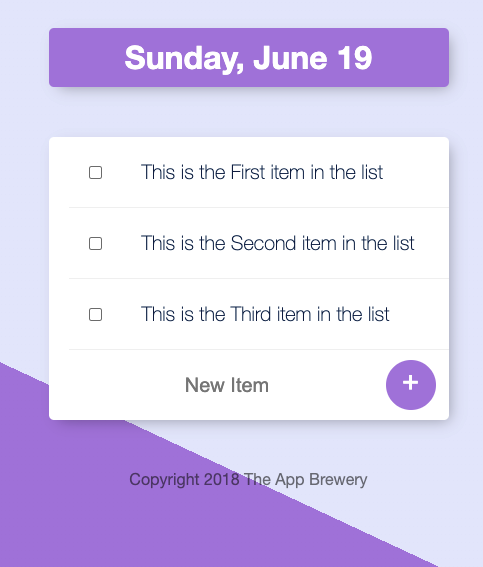

# BMI-EXPRESS-APP
This is a Simple To-Do-lLst from London App Brewery's Udemy Course 

 

## How It's Made:

**Tech used:** HTML, CSS, JavaScript, MongoDB, Mongoose, Node.js and Express

This project was reworked using the express framework and hosted on Heroku

## Use the Webapp

You can access this webapp by clicking here: [Simple To-Do-List](https://to-do-list-redo.herokuapp.com/) 

